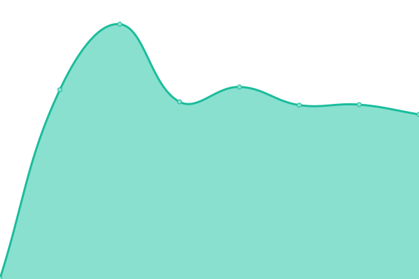
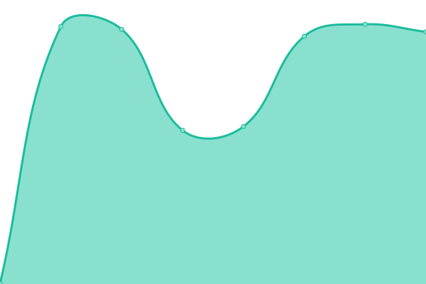
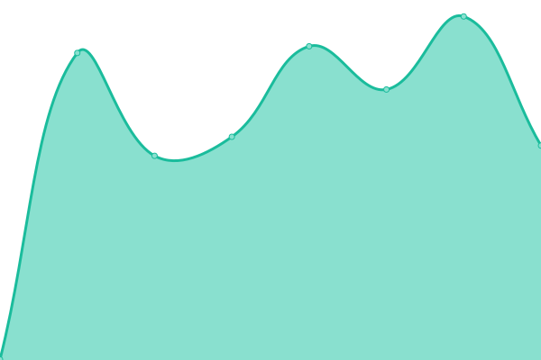
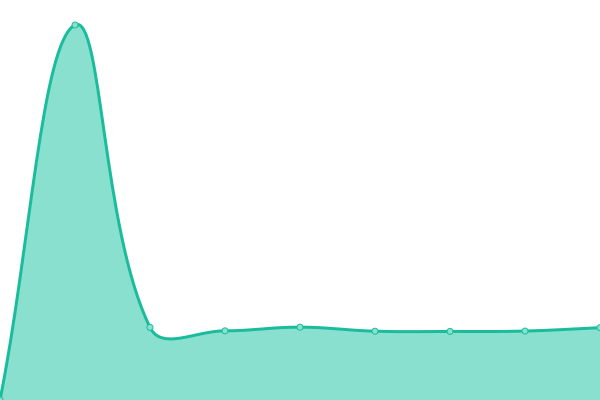

# [📈 Live Status](https://monitoring.numa.host): <!--live status--> **🟧 Partial outage**

This repository contains the open-source uptime monitor and status page for [GRAFO Research Group - Universidad Rey Juan Carlos](https://grafo.etsii.urjc.es), powered by [Upptime](https://github.com/upptime/upptime).

With [Upptime](https://upptime.js.org), you can get your own unlimited and free uptime monitor and status page, powered entirely by a GitHub repository. We use [Issues](https://github.com/GRAFO-URJC/monitoring/issues) as incident reports, [Actions](https://github.com/GRAFO-URJC/monitoring/actions) as uptime monitors, and [Pages](https://monitoring.numa.host) for the status page.

<!--start: status pages-->
<!-- This summary is generated by Upptime (https://github.com/upptime/upptime) -->
<!-- Do not edit this manually, your changes will be overwritten -->
<!-- prettier-ignore -->
| URL | Status | History | Response Time | Uptime |
| --- | ------ | ------- | ------------- | ------ |
|  [Proveedor de identidad](https://idp.numa.host) | 🟥 Down | [proveedor-de-identidad.yml](https://github.com/GRAFO-URJC/monitoring/commits/HEAD/history/proveedor-de-identidad.yml) | 

 604ms
     
 | 

<a href="https://monitoring.numa.host/history/proveedor-de-identidad">96.43%</a>
    

|  [DomJudge GDDV Algoritmos para Juegos](https://aj-gddv.numa.host) | 🟥 Down | [dom-judge-gddv-algoritmos-para-juegos.yml](https://github.com/GRAFO-URJC/monitoring/commits/HEAD/history/dom-judge-gddv-algoritmos-para-juegos.yml) | 

 1539ms
     
 | 

<a href="https://monitoring.numa.host/history/dom-judge-gddv-algoritmos-para-juegos">86.43%</a>
    

|  [DomJudge GICIB Diseño y Análisis de Algoritmos](https://daa-gicib.numa.host) | 🟥 Down | [dom-judge-gicib-diseno-y-analisis-de-algoritmos.yml](https://github.com/GRAFO-URJC/monitoring/commits/HEAD/history/dom-judge-gicib-diseno-y-analisis-de-algoritmos.yml) | 

 1516ms
     
 | 

<a href="https://monitoring.numa.host/history/dom-judge-gicib-diseno-y-analisis-de-algoritmos">86.44%</a>
    

|  [DomJudge GICIB Metodologías Desarrollo Seguro](https://mds-gcib.numa.host) | 🟥 Down | [dom-judge-gicib-metodologias-desarrollo-seguro.yml](https://github.com/GRAFO-URJC/monitoring/commits/HEAD/history/dom-judge-gicib-metodologias-desarrollo-seguro.yml) | 

 644ms
     
 | 

<a href="https://monitoring.numa.host/history/dom-judge-gicib-metodologias-desarrollo-seguro">86.46%</a>
    

|  [CTFd GICIB Metodologías Desarrollo Seguro](https://ctf-mds-gcib.numa.host) | 🟩 Up | [ct-fd-gicib-metodologias-desarrollo-seguro.yml](https://github.com/GRAFO-URJC/monitoring/commits/HEAD/history/ct-fd-gicib-metodologias-desarrollo-seguro.yml) | 

 513ms
     
 | 

<a href="https://monitoring.numa.host/history/ct-fd-gicib-metodologias-desarrollo-seguro">94.57%</a>
    

|  [DomJudge GIS Diseño y Análisis de Algoritmos](https://daa-gis.numa.host) | 🟥 Down | [dom-judge-gis-diseno-y-analisis-de-algoritmos.yml](https://github.com/GRAFO-URJC/monitoring/commits/HEAD/history/dom-judge-gis-diseno-y-analisis-de-algoritmos.yml) | 

 1553ms
     
 | 

<a href="https://monitoring.numa.host/history/dom-judge-gis-diseno-y-analisis-de-algoritmos">86.49%</a>
    

|  [DomJudge GIA Introducción a la Programación](https://ip-gia.numa.host) | 🟥 Down | [dom-judge-gia-introduccion-a-la-programacion.yml](https://github.com/GRAFO-URJC/monitoring/commits/HEAD/history/dom-judge-gia-introduccion-a-la-programacion.yml) | 

 1648ms
     
 | 

<a href="https://monitoring.numa.host/history/dom-judge-gia-introduccion-a-la-programacion">86.50%</a>
    

<!--end: status pages-->

[**Visit our status website →**](https://monitoring.numa.host)

## 📄 License

- Powered by: [Upptime](https://github.com/upptime/upptime)
- Code: [MIT](./LICENSE) © [GRAFO Research Group - Universidad Rey Juan Carlos](https://grafo.etsii.urjc.es)
- Data in the `./history` directory: [Open Database License](https://opendatacommons.org/licenses/odbl/1-0/)
